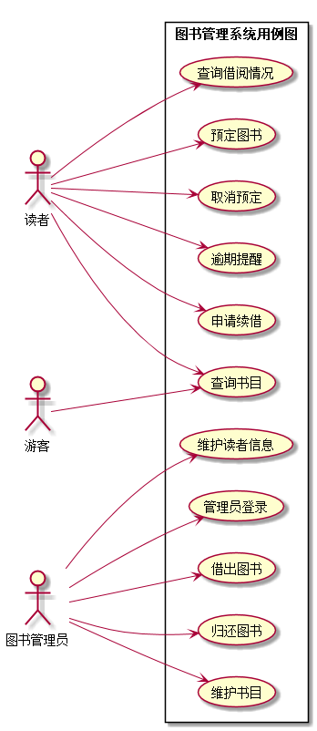

# 实验2：图书管理系统用例建模

|学号|班级|姓名|照片|  
|:-:|:-:|:-:|:-:|  
|201510414422|软件（本）15-4|杨东升| |

# 1.图书管理系统的用例关系图

### 1.1用例图PlantUML源码如下

```markdown
@startuml
actor 读者 as r
actor 图书管理员 as m
actor 游客 as v
left to right direction
rectangle 图书管理系统用例图{
    r ---> (查询书目)
    r ---> (查询借阅情况)
    r ---> (预定图书)
    r ---> (取消预定)
    r ---> (申请续借)

    m ---> (借出图书)
    m ---> (归还图书)
    m ---> (维护书目)
    m ---> (维护读者信息)
    m ---> (管理员登录)

    v ---> (查询书目)
}
@enduml
```

### 1.2用例图如下


## 2.参与者说明

### 2.1图书管理员

主要职责是：
(1)借出图书（登记）;  
(2)归还图书（登记）;   
(3)维护书目信息;  
(4)维护读者信息。  

### 2.2读者

主要职责是：
(1)预定图书；  
(2)借阅书籍；  
(3)归还书籍；  
(4)申请续借；  
(5)取消预定。   

### 2.3游客

主要职责是：
(1)查询书目。

# 3.用例规约表

## 3.1 “借出图书”用例规约

|用例名称|借出图书|  
|:-|:-|  
|参与者|图书管理员（主要参与者）、读者（次要参与者）|  
|前置条件|图书管理员已登陆到系统获得操作权限|  
|后置条件|存储借书记录，更新库存数量，所借图书状态为借出|  
|主事件流|  
|参与者动作|系统行为|  
|1.图书管理员将读者借书卡提供给系统<br>3.图书管理员将读者所借图书输入系统|2.系统验证读者身份和借书条件<br>4.系统记录借书信息，并且修改图书的状态和此种图书的可借数量<br>5.系统累加读者的借书数量<br>6.系统打印借书清单，交易成功完成|  
|备选事件流|2a.非法读者<br>  1.系统提示错误并拒绝接受输入<br>2b.读者借书数量已达到限额<br>  1.系统提示错误并拒绝接受输入<br>5a.读者借书书已达限额<br>  1.系统提示，并要求结束输入<br>   2.图书管理员确认借书完成<br>5b.读者有该书的预定信息<br>  1.删除该书的预定信息|


