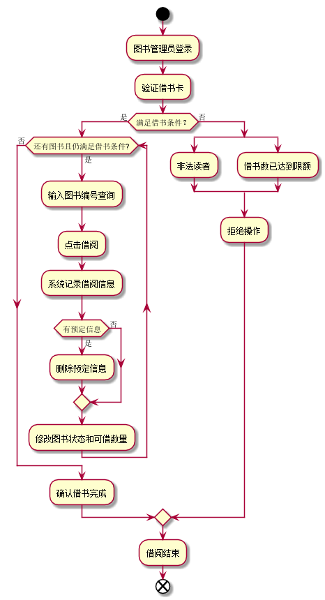
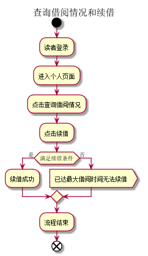
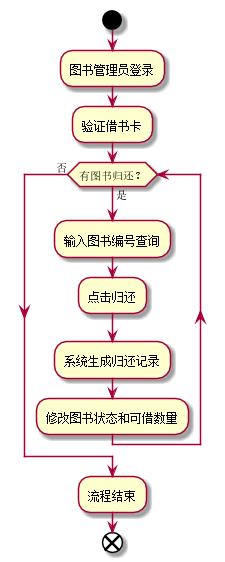
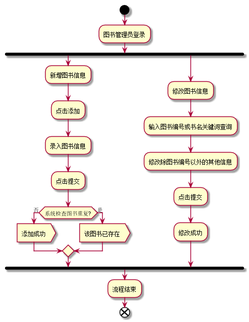

# 实验2：图书管理系统用例建模

|学号|班级|姓名|照片|  
|:-:|:-:|:-:|:-:|  
|201510414422|软件（本）15-4|杨东升| |

# 1.图书管理系统的用例关系图

### 1.1用例图PlantUML源码如下

```markdown
@startuml
actor 读者 as r
actor 图书管理员 as m
actor 游客 as v
left to right direction
rectangle 图书管理系统用例图{
    r ---> (查询书目)
    r ---> (查询借阅情况)
    r ---> (预定图书)
    r ---> (取消预定)
    r ---> (申请续借)

    m ---> (借出图书)
    m ---> (归还图书)
    m ---> (维护书目)
    m ---> (维护读者信息)
    m ---> (管理员登录)

    v ---> (查询书目)
}
@enduml
```

### 1.2用例图如下


## 2.参与者说明

### 2.1图书管理员

主要职责是：
(1)借出图书（登记）;  
(2)归还图书（登记）;   
(3)维护书目信息;  
(4)维护读者信息。  

### 2.2读者

主要职责是：
(1)预定图书；  
(2)借阅书籍；  
(3)归还书籍；  
(4)申请续借；  
(5)取消预定。   

### 2.3游客

主要职责是：
(1)查询书目。

# 3.用例规约表

## 3.1 “借出图书”用例规约

|用例名称|借出图书|  
|:-|:-|  
|参与者|图书管理员（主要参与者）、读者（次要参与者）|  
|前置条件|图书管理员已登陆到系统获得操作权限|  
|后置条件|存储借书记录，更新库存数量，所借图书状态为借出|  
|主事件流|  
|参与者动作|系统行为|  
|1.图书管理员将读者借书卡提供给系统<br>3.图书管理员将读者所借图书输入系统|2.系统验证读者身份和借书条件<br>4.系统记录借书信息，并且修改图书的状态和此种图书的可借数量<br>5.系统累加读者的借书数量<br>6.系统打印借书清单，交易成功完成|  
|备选事件流|2a.非法读者<br>  1.系统提示错误并拒绝接受输入<br>2b.读者借书数量已达到限额<br>  1.系统提示错误并拒绝接受输入<br>5a.读者借书书已达限额<br>  1.系统提示，并要求结束输入<br>   2.图书管理员确认借书完成<br>5b.读者有该书的预定信息<br>  1.删除该书的预定信息|

### “借出图书”用例流程图源码如下：

```markdown
@startuml
start
:图书管理员登录;
:验证借书卡;

if(满足借书条件？) then (是)
    while(还有图书且仍满足借书条件?) is (是)
    :输入图书编号查询;
    :点击借阅;
    :系统记录借阅信息;
    if(有预定信息) then(是)
        :删除预定信息;
        else (否)
    endif
    :修改图书状态和可借数量;
     end while(否)
     :确认借书完成;
    else (否)
     split
    :非法读者;
    split again
    :借书数已达到限额;
    end split
    :拒绝操作;
endif
:借阅结束;
end

@enduml
```

### “借出图书”用例流程图如下：



## 3.2“查询借阅情况和续借”用例规约

|用例名称|借出图书|  
|:-|:-|  
|参与者|读者（主要参与者）|  
|前置条件|读者已登录到图书馆网站获得操作权限|  
|后置条件|延长借阅时间，延后归还时间|  
|主事件流|  
|参与者动作|系统行为|  
|1.读者登录<br>3.登录成功<br>4.进入个人页面<br>5.点击查询借阅情况<br>6.点击续借<br>8.续借成功|2.系统验证登录权限<br>7.系统查询是否满足续借条件|  
|备选事件流|3a.登录失败<br>  1.用户名或密码错误<br>8a.续借失败<br>  1.已达最大借阅时间|

### “查询借阅情况和续借”用例流程图源码如下

```markdown
@startuml
title 查询借阅情况和续借
start
:读者登录;
:进入个人页面;
:点击查询借阅情况;
:点击续借;
if(满足续借条件) then(是)
    :续借成功;
    else (否)
    :已达最大借阅时间无法续借>
    endif
    :流程结束;
    end
@enduml
```

### “查询借阅情况和续借”用例流程图如下：



##3.3 “归还图书”用例规约

|用例名称|归还图书|  
|:-|:-|  
|参与者|图书管理员（主要参与者）、读者（次要要参与者）|  
|前置条件|图书管理员已登录到系统获得操作权限|  
|后置条件|生成归还记录，更新库存数量，所借图书状态为可借|  
|主事件流|  
|参与者动作|系统行为|  
|1.图书管理员登录<br>2.图书管理员将借书卡提供给系统<br>4.输入图书编号查询<br>5.点击归还|3.系统验证借书卡<br>6.系统生成归还记录<br>7.系统修改图书状态和可借数量|


### “归还图书”用例流程图源码如下：

```markdown
@startuml
start
:图书管理员登录;
:验证借书卡;
while(有图书归还？) is (是)
    :输入图书编号查询;
    :点击归还;
    :系统生成归还记录;
    :修改图书状态和可借数量;
    end while (否)
    :流程结束;
    end
@enduml
```
### “归还图书”用例流程图如下：



## 3.4“维护图书信息”用例规约

|用例名称|归还图书|  
|:-|:-|  
|参与者|图书管理员|  
|前置条件|图书管理员已登录到系统获得操作权限|  
|后置条件|生成归还记录，更新库存数量，所借图书状态为可借|  
|主事件流|  
|参与者动作|系统行为|  
|1.图书管理员登录<br>2.点击添加<br>3.录入图书信息<br>4.点击提交<br>6.添加成功|5.系统检查图书是否重复|
|备选事件流|6a.添加失败<br>  该图书已存在|

### “维护图书信息”用例流程图源码如下：

```markdown
@startuml
start
:图书管理员登录;
fork
:新增图书信息;
:点击添加;
:录入图书信息;
:点击提交;
if(系统检查图书重复?) then(否)
    :添加成功>
    else (是)
    :该图书已存在>
    endif
fork again
:修改图书信息;
:输入图书编号或书名关键词查询;
:修改除图书编号以外的其他信息;
:点击提交;
:修改成功;
end fork
:流程结束;
end
@enduml
```

### “维护图书信息”用例流程图如下：

