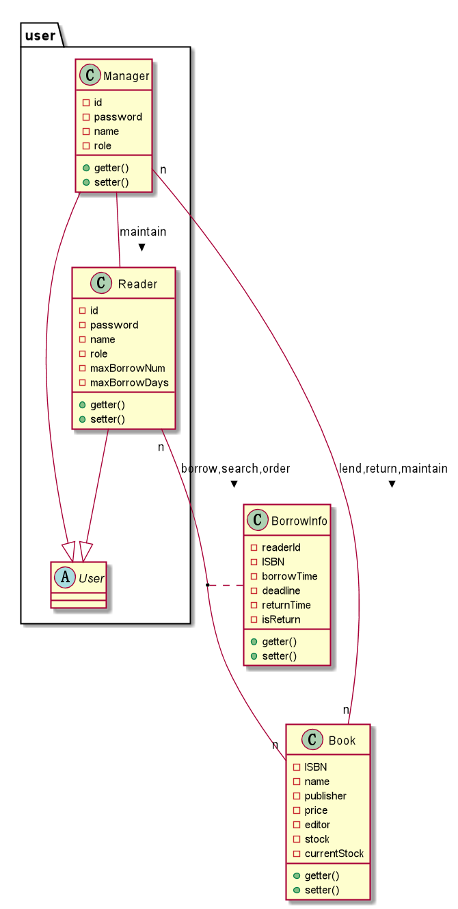
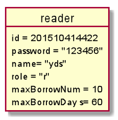
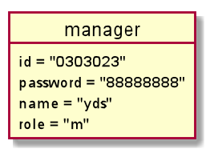
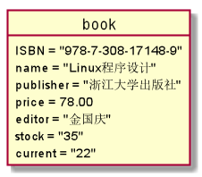
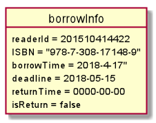

# 实验3 图书管理系统领域对象建模

|学号|班级|姓名|照片|  
|:-:|:-:|:-:|:-:|  
|201510414422|软件（本）15-4|杨东升| |

## 1.图书管理系统的类图
### 1.1类图 PlantUML源码如下
```markdown
@startuml


class Book{
    -ISBN
    -name
    -publisher
    -price
    -editor
    -stock
    -currentStock
    +getter()
    +setter()
}

class BorrowInfo{
    -readerId
    -ISBN
    -borrowTime
    -deadline
    -returnTime
    -isReturn
    +getter()
    +setter()
}
package "user"{
abstract Class User{

}
    class Reader{
            -id
            -password
            -name
            -role
            -maxBorrowNum
            -maxBorrowDays
            +getter()
            +setter()
    }

    class Manager{
        -id
        -password
        -name
        -role
        +getter()
        +setter()
    }
}
Reader --|> User
Manager --|> User
Reader "n" -- "n" Book:> borrow,search,order
(Reader,Book) .. BorrowInfo
Manager "n" -- "n" Book:> lend,return,maintain
Manager -- Reader: > maintain

@enduml
```

### 1.2 类图如下


### 1.3 类图说明
```markdown
   1.类图中包含五个类，其中一个抽象类User，和四个普通类Book,Reader,Manager,BorrowInfo；
   2.User，Reader，Manager同属于user包中,Reader和Manager继承自User抽象类
   3.Reader 和 Book是多对多的借阅关系，即一个读者可以借阅多本不同的数，不同的读者可以借阅ISBN相同的书
   4.Manager 和 Book 是多对多的关系，即一个管理员可以管理多种不同图书，而不同的管理员也可以管理同一种图书
```

## 2.图书管理系统的对象图

### 2.1 类Reader对象图
源码如下:
```markdown
@startuml
object reader{
    id = 201510414422
    password = "123456"
    name= "yds"
    role = "r"
    maxBorrowNum = 10
    maxBorrowDay s= 60
}
@enduml
```

对象图如下：



### 2.2 类Manager对象图
源码如下：
```markdown
@startuml
object manager{
    id = "0303023"
    password = "88888888"
    name = "yds"
    role = "m"
}
@enduml
```

对象图如下：



### 2.3 类Book对象图
源码如下：
```markdown
object book{
    ISBN = "978-7-308-17148-9"
    name = "Linux程序设计"
    publisher = "浙江大学出版社"
    price = 78.00
    editor = "金国庆"
    stock = "35"
    current = "22"
}
@enduml
```

对象图如下：



### 2.4 类BorrowInfo对象图
源码如下：
```markdown
@startuml
object borrowInfo{
    readerId = 201510414422
    ISBN = "978-7-308-17148-9"
    borrowTime = 2018-4-17"
    deadline = 2018-05-15
    returnTime = 0000-00-00
    isReturn = false
}
@enduml
```

对象图如下：



