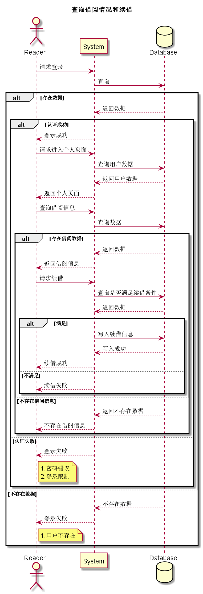
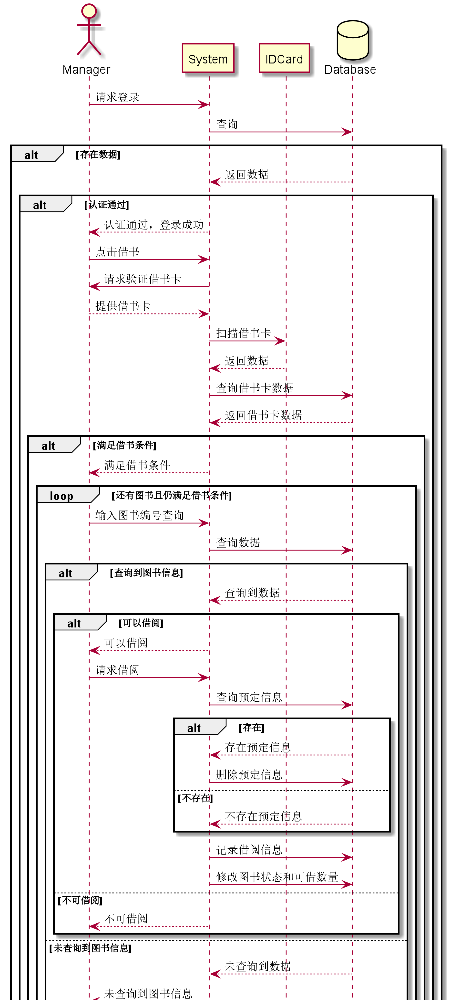
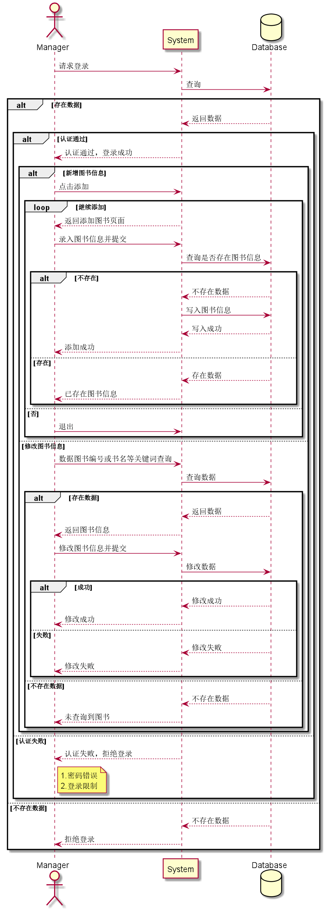
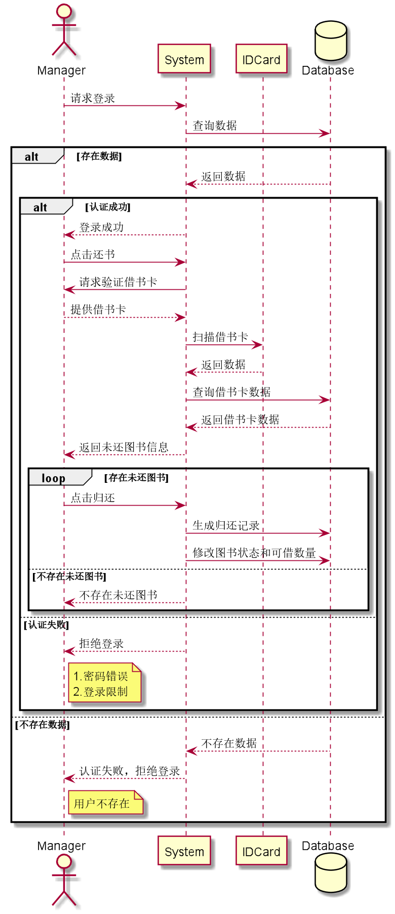

#实验4：图书管理系统顺序图绘制

|学号|班级|姓名|照片|  
|:-:|:-:|:-:|:-:|  
|201510414422|软件（本）15-4|杨东升| |

##图书管理系统顺序图

##1.查询借阅信息和续借用例

###1.1查询借阅信息和续借用例源码

```markdown
@startuml
title 查询借阅情况和续借
actor Reader as r
participant System as s
database Database as d
r -> s:请求登录
s -> d:查询
alt 存在数据
    d --> s:返回数据
    alt 认证成功
        s --> r:登录成功
        r -> s:请求进入个人页面
        s -> d:查询用户数据
        d --> s:返回用户数据
        s --> r:返回个人页面
        r -> s:查询借阅信息
        s -> d:查询数据
        alt 存在借阅数据
            d --> s:返回数据
            s --> r:返回借阅信息
            r -> s:请求续借
            s -> d:查询是否满足续借条件
            d --> s:返回数据
            alt 满足
                s -> d:写入续借信息
                d -->s:写入成功
                s --> r:续借成功
            else 不满足
                s --> r:续借失败
            end
        else 不存在借阅信息
            d --> s:返回不存在数据
            s --> r:不存在借阅信息
        end
    else 认证失败
        s --> r:登录失败
        note right of r
            1.密码错误
            2.登录限制
        end note
    end
else 不存在数据
    d --> s:不存在数据
    s --> r:登录失败
    note right of r
        1.用户不存在
    end note
end

@enduml
```

###1.2查询借阅信息和续借用例顺序图



###1.3查询借阅信息和续借用例顺序图说明

```markdown
参与者：manager（图书管理员）、System（系统）、Database（数据库）
```


##2.借阅图书用例

###2.1借阅图书用例源码
```markdown
@startuml
actor Manager as m
participant System as s
participant IDCard as c
database Database as d
m -> s:请求登录
s -> d:查询
alt 存在数据
    d --> s:返回数据
    alt 认证通过
        s --> m:认证通过，登录成功
        m -> s:点击借书
        s -> m:请求验证借书卡
        m --> s:提供借书卡
        s -> c:扫描借书卡
        c --> s:返回数据
        s -> d:查询借书卡数据
        d --> s:返回借书卡数据
        alt 满足借书条件
            s --> m:满足借书条件
            loop 还有图书且仍满足借书条件
                m -> s:输入图书编号查询
                s -> d:查询数据
                alt 查询到图书信息
                    d --> s:查询到数据
                    alt 可以借阅
                        s --> m:可以借阅
                        m -> s:请求借阅
                        s -> d:查询预定信息
                        alt 存在
                            d --> s:存在预定信息
                            s -> d:删除预定信息
                        else 不存在
                            d --> s:不存在预定信息
                        end
                        s -> d:记录借阅信息
                        s -> d:修改图书状态和可借数量
                    else 不可借阅
                        s --> m:不可借阅
                    end
                else 未查询到图书信息
                    d --> s:未查询到数据
                    s --> m:未查询到图书信息
                end
            else 没有图书
                m -> s:确认借书完成
            else 不满足借书条件
                s --> m:拒绝操作
                note right of m
                    1.借书已达到限额
                end note
                m -> s:确认借书完成
            end
        else 不满足借书条件
            s --> m:拒绝操作
            note right of m
                1.非法读者
                2.借书以达到限额
            end note
        end
    else 认证失败
        s --> m:认证失败，拒绝登录
        note right of m
            1.密码错误
            2.登录限制
        end note
    end
else 不存在数据
    d --> s:不存在数据
    s --> m:拒绝登录
end

@enduml
```
###2.2借阅图书用例顺序图



###2.3借阅图书用例顺序图说明

```markdown
参与者：Manager（图书管理员）、System（系统）、IDCard（借书卡）、Database（数据库）
```

##3维护图书用例

###3.1维护图书用例源码
```markdown
@startuml
actor Manager as m
participant System as s
database Database as d

m -> s:请求登录
s -> d:查询
alt 存在数据
    d --> s:返回数据
    alt 认证通过
        s --> m:认证通过，登录成功
        alt 新增图书信息
            m -> s:点击添加
            loop 继续添加
                s --> m:返回添加图书页面
                m -> s:录入图书信息并提交
                s -> d:查询是否存在图书信息
                alt 不存在
                    d --> s:不存在数据
                    s -> d:写入图书信息
                    d --> s:写入成功
                    s --> m:添加成功
                else 存在
                    d --> s:存在数据
                    s --> m:已存在图书信息
                end
            else 否
                m -> s:退出
            end loop

        else 修改图书信息
            m -> s:数据图书编号或书名等关键词查询
            s -> d:查询数据
            alt 存在数据
                d --> s:返回数据
                s --> m:返回图书信息
                m -> s:修改图书信息并提交
                s -> d:修改数据
                alt 成功
                    d --> s:修改成功
                    s --> m:修改成功
                else 失败
                    d --> s:修改失败
                    s --> m:修改失败
                end
            else 不存在数据
                d --> s:不存在数据
                s --> m:未查询到图书
            end
        end
    else 认证失败
        s --> m:认证失败，拒绝登录
        note right of m
            1.密码错误
            2.登录限制
        end note
    end
else 不存在数据
    d --> s:不存在数据
    s --> m:拒绝登录
end

@enduml
```

###3.2维护图书用例顺序图



###3.3维护图书用例顺序图说明
```markdown
参与者:Manager（图书管理员）、System（系统）、Database（数据库）
```

##4.还书用例

###4.1还书用例源码
```markdown
@startuml
actor Manager as m
participant System as s
participant IDCard as c
database Database as d

m -> s:请求登录
s -> d:查询数据
alt 存在数据
    d --> s:返回数据
    alt 认证成功
        s --> m:登录成功
        m -> s:点击还书
        s -> m:请求验证借书卡
        m --> s:提供借书卡
        s -> c:扫描借书卡
        c --> s:返回数据
        s -> d:查询借书卡数据
        d --> s:返回借书卡数据
        s --> m:返回未还图书信息
        loop 存在未还图书
            m -> s:点击归还
            s -> d:生成归还记录
            s -> d:修改图书状态和可借数量
        else 不存在未还图书
            s --> m:不存在未还图书
        end
    else 认证失败
        s --> m:拒绝登录
        note right of m
            1.密码错误
            2.登录限制
        end note
    end
else 不存在数据
    d -->s:不存在数据
    s -->m:认证失败，拒绝登录
    note right of m
        用户不存在
    end note
end
@enduml
```

###4.2还书用例顺序图



###4.2还书用例顺序图说明
```markdown
参与者：Manager（图书管理员）、System（系统）、IDCard（借书卡）、Database（数据库）
```


