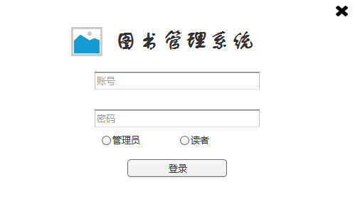
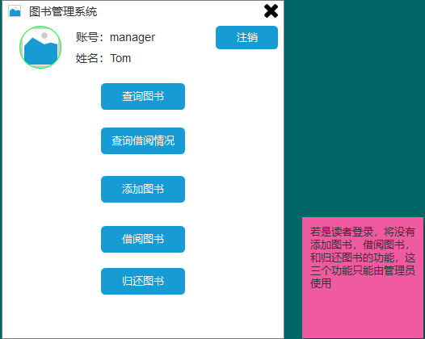

# 实验5：图书管理系统数据库设计与界面设计

|学号|班级|姓名|照片|  
|:-:|:-:|:-:|:-:|  
|201510414422|软件（本）15-4|杨东升| |

## 1.数据库表设计


### 1.1图书表

|字段|类型|主键、外键|可以为空|自增|默认值|说明|  
|:-:|:-:|:-:|:-:|:-:|:-:|:-:|  
|ISBN|varchar(45)|主键|否|||图书编码|    
|name|varchar(255)||否|||NULL|书名|   
|publisher|varchar(255)||是||NULL|出版社|  
|price|double(10,2)||是||0|价格|   
|editor|varchar(45)||是||NULL|编辑|  
|stock|int(10)||是||0|库存|  
|current|int(10)||是||=stock|当前存量|

### 1.2借阅信息表

|字段|类型|主键、外键|可以为空|默认值|说明|自增|  
|:-:|:-:|:-:|:-:|:-:|:-:|:-:|  
|id|int(10)|主键|否|0|0000000000|是|  
|reader_id|int(10)|外键|否||读者id||  
|ISBN|varchar(45)|外键|否||图书编码||  
|borrow_time|date||是|0000-00-00|借阅日期||  
|deadline|date||是|0000-00-00|最终应还日期||  
|return_time|date||是|0000-00-00|实际归还日期||  
|is_return|tinyint(1)||是|0|是否归还||

### 1.3管理员表

|字段|类型|主键、外键|可以为空|自增|默认值|说明|  
|:-:|:-:|:-:|:-:|:-:|:-:|:-:|  
|id|int(10)|主键|否|是|0000000000|管理员id|  
|password|varchar(45)||是||123456|||  
|name|varchar(45)||是||=id|管理员姓名|  
|role|varchar(45)||否|| 'm' |角色|  


### 1.4读者表

|字段|类型|主键、外键|可以为空|自增|默认值|说明|  
|:-:|:-:|:-:|:-:|:-:|:-:|:-:|  
|id|int(10)|主键|否|是|0000000000|记录id|  
|account|varchar(45)|主键|否|||账号|  
|password|varchar(45)||是||123456|密码|  
|name|varchar(45)||否|||读者姓名|  
|role|varchar(45)||否|| 'r' |角色|  
|max_borrow_num|int(10)||否||5|最大同时借阅数量|  
|max_borrow_days|int(10)||否||60|最大借阅天数|  

## 2.界面设计

### 2.1登录界面



### 2.2功能界面



## 3.接口设计

### 3.1用户登录

功能：用户（管理员、读者）登录<br/>
请求地址：http://localhost:8080/library/user/login<br/>
请求方法：POST<br/>
请求参数：<br/>

|参数名称|必填|说明|    
|:-:|:-:|:-:|  
|account|是|账号|  
|password|是|密码|  
|role|是|用于验证登录角色|  

返回实例：

```json
{
    "status":1,
    "data":
        {
            "id":"0324098032",
            "account":"201510414422",
            "name":"yds",
            "role":"r",
            "maxBorrowNum":5,
            "maxBorrowDays":60
        }
}
```

### 3.2查询图书

功能：查询图书信息<br/>
请求地址：http://localhost:8080/library/book/query<br/>
请求方法：POST<br/>
请求参数：<br/>
|参数名称|必填|说明|       
|:-:|:-:|:-:|  
|keyword|是|关键词|  
|type|是|默认为ISBN查询,可选有name,publisher,editor|  
|sort|是|排序方法|  


返回实例：


```json
{
    "status":1,
    "data":
        {
            "isbn":"978-7-308-17148-9",
            "name":"Linux程序设计",
            "publisher":"浙江大学出版社",
            "price":78.00,
            "editor":"金国庆",
            "stock":35,
            "current":22
        }
}
```
