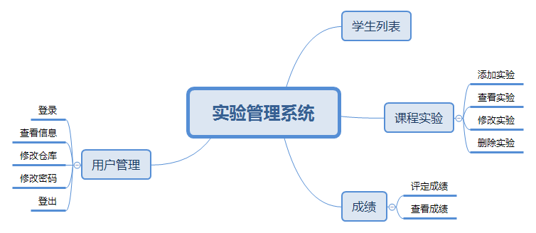
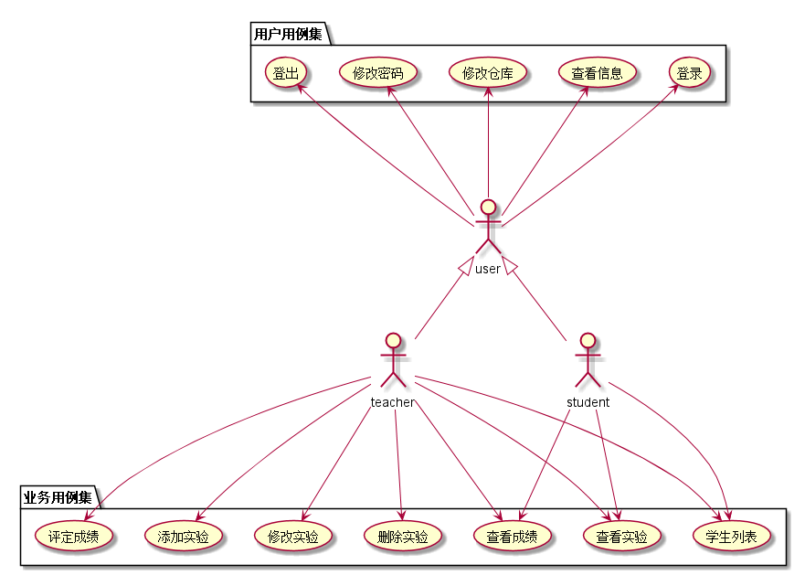
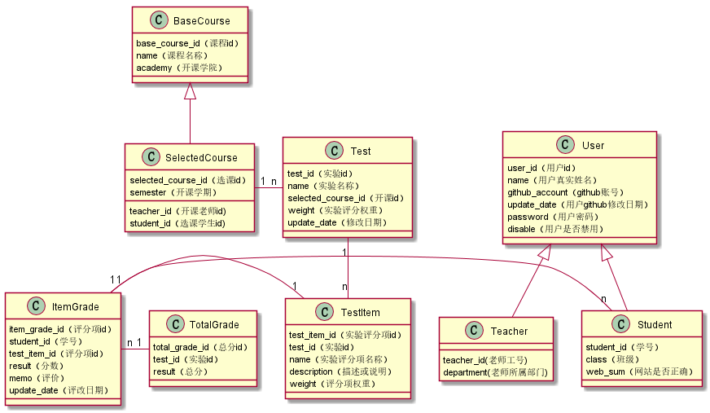

# 基于github的实验管理平台设计

### 成都大学信息科学与工程学院
|学号|班级|姓名|照片|  
|:-:|:-:|:-:|:-:|  
|201510414422|软件（本）15-4|杨东升| |

## 1.概述
<li>基于GitHub的实验管理平台的作用是在线管理实验成绩的Web应用系统，本系统基于多学期，多课程，多评分项的实现。学生和老师的实验内容均存放在GitHUB 页面上。</li>
<li>学生的功能主要有：一是设置自己的GitHub用户名，二是查询自己的实验成绩,三是产看每个课程的实验要求,学生的GitHub用户名是公开的，但成绩不公开。</li>
<li>老师的功能主要有：一是批改每个学生的成绩，二是查看每个学生的成绩，三是添加实验，修改实验，查看实验和删除实验</li>
<li>老师和学生都能通过本系统的链接方便地跳转到学生的每个GitHUB实验目录，以便批改实验或者查看实验情况。</li>
<li>每个学生有多个课程，每个学期也有不同的课程，每个课程可以有多个实验，每个实验可以有多个评分项，每个实验和评分项都有自己的评分权重，分数范围为0~100,评分权重为0~1，权重的正确性由教师自己保障</li>
<li>系统自动计算实验的加权平均分和每个评分项的加权平均分</li>

## 2.系统总体结构

界面设计参见<a href="ui_png">./ui_png</a>

## 3.用例图设计<a href="src/usercase实验管理系统.puml">源码</a>

## 4.类图设计<a href="src/class实验管理系统.puml">源码</a>

## 5.数据库设计
<li><a href="数据库设计.md">参见数据库设计</a></li>

## 6.用例及界面详细设计
<li><a href="用例/修改仓库.md">修改仓库用例</a><a href="ui_png/modifyrepositorypopwindow.png">界面</a></li>
<li><a href="用例/修改实验.md>修改实验用例</a><a href="ui_png/addexperiment.png">界面</a></li>
<li><a href="用例/修改密码.md">修改密码用例</a><a href="ui_png/modifypasswordpopwindow.png">界面</a></li>
<li><a href="ui_png/mycoursebyteacher.png">界面</a></li>
<li><a href="ui_png/studentlistbyteacher.png">界面（教师）</a><a href="ui_png/studentlistbyteacher">界面（学生）</a></li>
<li><a href="ui_png/mycoursebyteacher.png">界面（教师）</a><a href="ui_png/mycoursebystudent">界面（学生）</a></li>
<li><a href="ui_png/addexperiment.png">界面</a></li>
<li><a href="ui_png/memo.png">界面</a></li>
<li><a href="ui_png/userinfopopwindow.png>界面</a></li>
<li><a href="ui_png/addexperiment.png">界面</a></li>
<li><a href="ui_png/index.png">界面</a></li>

