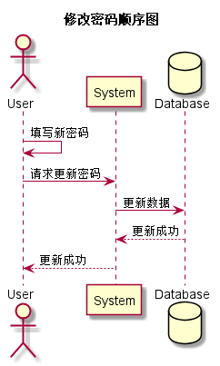

### 修改密码用例
## 1.用例规约
|用例名称|修改密码|  
|:-|:-|  
|功能|修改用户登录密码|  
|参与者|学生，老师|  
|前置条件|已登录|  
|后置条件|修改密码后必须强制登出，再跳转到登录页面|
|主事件流|1.用户填写新密码（两次输入） 2.用户提交修改信息 3.系统存储修改后密码|  
|备选事件流|1a. 用户两次输入的密码不同 1.系统提示两次输入的密码不相同 2. 用户重新填写并提交。|

## 2.业务流程（顺序图）<a href="../src/sequence/sequence修改密码.puml">源码</a>

## 3.界面设计

<li>界面参照<a href="../ui_png/modifypasswordpopwindow">修改密码</a></li>
<li>
API接口调用
<ol>
<li><a href="../接口/modifyPassword.md">modifyPassword</a></li>
</ol>
</li>

## 4.参照表

<li><a href="../数据库设计.md/#user">user</a></li>
