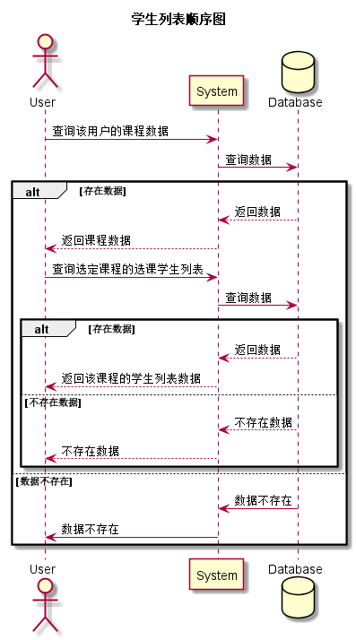

### 学生列表用例
## 1.用例规约
|用例名称|学生列表|  
|:-|:-|  
|功能|显示学生列表|  
|参与者|学生，老师|  
|前置条件|学生，老师需先登录，当页面刷新时若无用户登录则强制跳转到登录页面|  
|后置条件||
|主事件流|| 
|备选事件流||

## 2.业务流程（顺序图）<a href="../src/sequence/sequence学生列表.puml">源码</a>

## 3.界面设计

<li>界面参照<a href="../ui_png/studentlistbystudent.png">学生列表（学生）</a></li>
<li>界面参照<a href="../ui_png/studentlistbyteacher.png">学生列表（老师）</a></li>

<li>
API接口调用
<ol>
<li><a href="../接口/getStudentList.md">getStudentList</a></li>
</ol>
</li>

## 4.参照表

<li><a href="../数据库设计.md/#selected_course">selected_course</a></li>