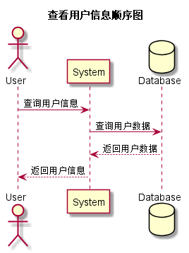

### 查看用户信息用例
## 1.用例规约
|用例名称|查看用户信息|  
|:-|:-|  
|功能|查看用户信息|  
|参与者|学生，老师|  
|前置条件|学生，老师需先登录|  
|后置条件||
|主事件流||  
|备选事件流||

## 2.业务流程（顺序图）<a href="../src/sequence/sequence查看用户信息.puml">源码</a>

## 3.界面设计

<li>界面参照<a href="../ui_png/userinfopopwindow.png">用户信息</a></li>
<li>
API接口调用
<ol>
<li><a href="../接口/getUserInfo.md">getUserInfo</a></li>
</ol>
</li>

## 4.参照表

<li><a href="../数据库设计.md/#user">user</a></li>