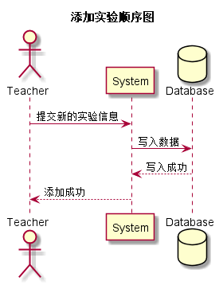

### 添加实验用例
## 1.用例规约
|用例名称|添加实验|  
|:-|:-|  
|功能|添加课程实验|  
|参与者|老师|  
|前置条件|老师需先登录|  
|后置条件||
|主事件流| 1.填写实验信息,添加评分项 2.点击保存 3.系统提示保存成功或失败|  
|备选事件流|2.有未填写内容 2a.系统提示填写完整|

## 2.业务流程（顺序图）<a href="../src/sequence/sequence添加实验.puml">源码</a>

## 3.界面设计

<li>界面参照<a href="../ui_png/addexperiment.png">添加实验</a></li>
<li>
API接口调用
<ol>
<li><a href="../接口/addTest.md">addTest</a></li>
</ol>
</li>

## 4.参照表

<li><a href="../数据库设计.md/#test">test</a></li>
<li><a href="../数据库设计.md/#test_item">test_item</a></li>