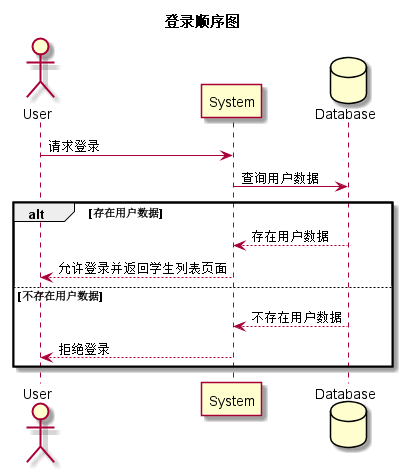

### 登录用例
## 1.用例规约
|用例名称|登录|  
|:-|:-|  
|功能|登录平台|  
|参与者|学生，老师|  
|前置条件|无|  
|后置条件|登录成功后，跳转到学生列表页面|
|主事件流|1.用户输入账号和密码，选择用户类型 2.系统判断账号，密码，用户类型正确，允许登录 3.系统在客户端以Cookie形式存储用户登录信息，保持登录的持久性|  
|备选事件流|1a.输入账号或密码为空   1.提示重新输入 2.用户重新提交登录信息 2a.系统判断用户名密码，用户类行不正确，不允许登录 1.提示重新输入 2.用户重新提交登录信息|  

## 2.业务流程（顺序图）<a href="../src/sequence/sequence登录.puml">源码</a>

## 3.界面设计

<li>界面参照<a href="../ui_png/index.png">登录</a></li>
<li>
API接口调用
<ol>
<li><a href="../接口/login.md">login</a></li>
</ol>
</li>

## 4.参照表

<li><a href="../数据库设计.md/#=user">user</a></li>
